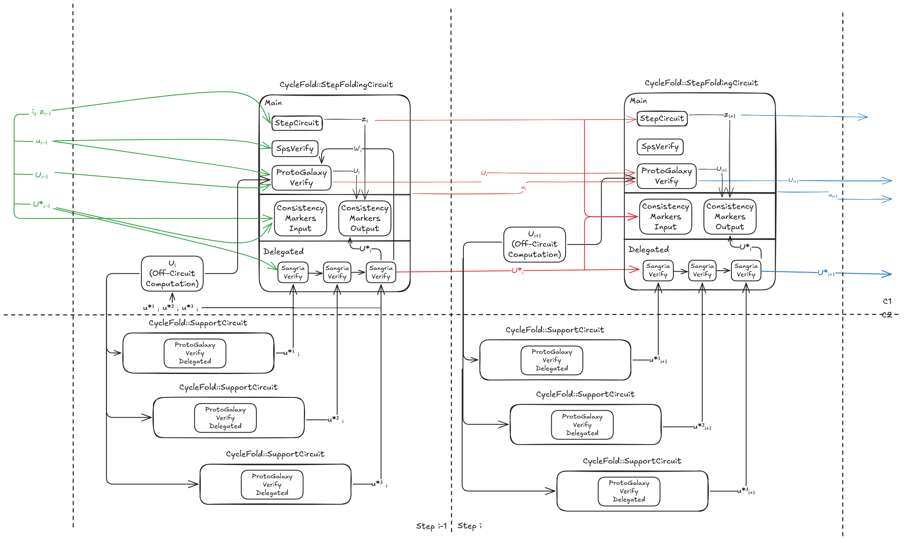

# Report on the Implementation of CycleFold & Protogalaxy

This report describes **how** we implemented the integrated **CycleFold + Protogalaxy** protocol in practice, referencing the architecture shown in the diagram above. After discussing the design decisions and code structure, we highlight off‐circuit polynomial computations, on‐circuit verifications (using the **CycleFold‐SupportCircuit**), and how we achieve data‐parallelism with **Rayon** in Rust.



---

## 1. Motivation & Overview

- **Protogalaxy**: A multi‐folding scheme that handles multiple polynomial instances efficiently. It introduces off‐circuit computations of three univariate polynomials **F**, **G**, **K** (see the **Off‐Circuit Computation** box in the diagram), then folds these into a single "accumulator" instance using **Plonkish**‐style constraints.

[Protogalaxy Paper](https://eprint.iacr.org/2023/1106)

- **CycleFold**: A protocol that *delegates* certain elliptic‐curve operations to a *small circuit on a second curve*, avoiding expensive non‐native arithmetic in the main circuit. In the diagram, these delegated checks appear as **Delegation Markers** or "SPS verify" lines. The resulting constraints are folded back in the **CycleFold‐SupportCircuit**, labeled "Provisional Verifier" or "Preliminary Verifier" in the diagram.

[CycleFold Paper](https://eprint.iacr.org/2023/1192)

By combining these two, we obtain a scalable Incrementally Verifiable Computation (IVC) system that addresses both *multi‐instance polynomial folding* (Protogalaxy) and *cross‐curve scalar multiplications* (CycleFold) with minimal overhead in the main circuit—**all within a Plonkish framework**.

---

## 2. Code Structure

Below is a brief guide to the main modules, focusing on how we **implemented** the system in code:

- **[`nifs/protogalaxy/`](../src/nifs/protogalaxy/)**  
  - **[`compute_F`, `compute_G`, `compute_K`](../src/nifs/protogalaxy/poly/mod.rs)**: Core polynomial computations for Protogalaxy. They rely on data‐parallel processing with [**rayon**](https://docs.rs/rayon/latest/rayon/) for chunking and partial sums.
  - **[`accumulator.rs`](../src/nifs/protogalaxy/accumulator.rs)**: Defines the accumulator data structures for the Protogalaxy folding scheme (tracking polynomial commitments, challenges, etc.).
  - **[`ProtoGalaxy`](../src/nifs/protogalaxy/mod.rs)**: Main protocol code implementing the Non-Interactive Folding Scheme from the paper. It handles the complete flow from setup to proof generation and verification, with key methods like `prove()` and `verify()` that orchestrate the folding process. The implementation leverages random oracles for challenge generation, computes polynomial evaluations (F, K), and includes comprehensive satisfaction checks for accumulator verification.

- **[`ivc/cyclefold/`](../src/ivc/cyclefold/)**  
   - **[`step folding circuit`](../src/ivc/cyclefold/sfc/mod.rs)** : This circuit orchestrates the folding process of multiple execution steps. It handles the verification of Protogalaxy accumulator instances, supports cross-curve operations through delegation markers, and maintains consistency across iterations using a random oracle-based consistency marker.
   - **[`support circuit`](../src/ivc/cyclefold/support_circuit/mod.rs)** : A specialized small circuit that efficiently performs elliptic curve operations (scalar multiplications) that would be expensive in the main circuit. It processes delegated operations from the step folding circuit, verifying that `p0*l0 + p1*l1` equals the expected output point.

## 3. NIFS Polynomial Computations (Protogalaxy)

The Protogalaxy component of our system implements the core off‐circuit folding operations by computing three key univariate polynomials—F(X), G(X), and K(X)—that collectively "fold" multiple instances into a single accumulator. This design follows the strategy described in the original paper.

- **F(X) Computation:**  
  F(X) is defined as  
  ```
  F(X) = Σ_{i=0}^{n-1} pow_i(β + X·δ)·f_i(w)
  ```  
  Here, `f_i(w)` are evaluations derived from the witness, and `pow_i` applies the challenge (with bit-decomposition) to each term. Our implementation builds a binary tree over these values using parallel reductions (via Rayon) to combine the weighted terms, and then employs an FFT (and its inverse) to obtain the polynomial's coefficients in O(n) time.

- **G(X) Computation:**  
  G(X) aggregates not only the primary witness but also the additional instance data through Lagrange interpolation. It is given by  
  ```
  G(X) = Σ_{i=0}^{n-1} pow_i(β + α·δ)·f_i(L_0(X)w + Σ_{j∈[k]} L_j(X)w_j)
  ```  
  The use of Lagrange polynomials L_j(X) allows us to "mix" the accumulator and extra instances in a controlled way. Similar to F(X), we compute G(X) using a tree-based aggregation method and FFTs, ensuring efficient handling even when folding several instances concurrently.

- **K(X) Computation:**  
  Finally, K(X) is computed by "extracting" the remainder of G(X) after factoring out the contribution of the accumulator at a specific challenge α. Formally, it satisfies  
  ```
  G(X) = F(α)L_0(X) + Z(X)K(X)
  ```  
  where Z(X) is the vanishing polynomial over the folding domain. This step involves polynomial division and an FFT on a coset to efficiently determine K(X), ensuring the folding relation holds.

In summary, the Protogalaxy computations are designed to be highly efficient by combining parallel tree reductions (to aggregate many weighted evaluations) with FFT-based polynomial transformations. This implementation mirrors the high-level protocol from the original paper while adapting to a practical Rust codebase, striking a balance between mathematical rigor and real-world performance.

## 4. IVC Computations (Cyclefold)

Our **CycleFold** approach leverages a *two‐curve* architecture to achieve Incrementally Verifiable Computation (IVC). Whereas **Protogalaxy** handles *polynomial folding* (see Section 3), **CycleFold** delegates *cross‐curve scalar multiplication* checks to a *tiny secondary circuit* on a second curve, then *folds* those delegated checks back into the main circuit. This division allows the *main circuit* to remain relatively lightweight, while the *support circuit* handles otherwise expensive non‐native operations on a more "native" field.

At a high level, the main circuit is called the **Step Folding Circuit**, which accumulates constraints from each incremental step of the computation (e.g., verifying the Protogalaxy accumulator, checking consistency markers, etc.). Whenever a scalar multiplication or point addition on the *other* curve's base field is required, we delegate it to the **Support Circuit** (a compact circuit on the second curve). The Step Folding Circuit only needs to verify the *delegated markers* that reference this small circuit's outputs—greatly reducing the overhead in the main circuit.

The final outcome is an IVC scheme that cycles proofs between two elliptic curves—one for the main Step Folding Circuit, and another for the Support Circuit. Concretely, the system maintains two accumulators:

- A **primary accumulator** (via Protogalaxy) on the *first curve*, capturing the polynomial folding and the step‐to‐step transitions.
- A **support accumulator** (via Sangria or Nova‐like folding) on the *second curve*, capturing the delegated elliptic checks.

When combined, these yield a succinct proof flow across an unbounded number of steps. In practice, we implement **CycleFold** in Rust with data structures and logic that mirror Protogalaxy's approach (e.g., random oracles, partial sums, chunked polynomial evaluation) but extended to handle cross‐curve commitments. The main entry points are in [`ivc/cyclefold/mod.rs`](../src/ivc/cyclefold/mod.rs), where the `IVC` struct orchestrates the step‐by‐step folding (via `IVC::next()`) and final verification (`IVC::verify()`).

Next, we describe the two key circuits in detail.

### 4.1 Step Folding Circuit

The **Step Folding Circuit** is the *primary circuit* in CycleFold, responsible for coordinating each "step" of the IVC pipeline on the **first curve**. As shown in the diagram, it verifies:

1. **Protogalaxy Accumulator** checks, ensuring that multiple polynomial instances (folded off‐circuit) are valid and consistent with the previous step's accumulator.
2. **Delegation Markers** from the **Support Circuit**, confirming that any cross‐curve scalar multiplications or point additions (delegated to the second curve) align with the main circuit's state.
3. **Step Circuit Logic** for user‐provided computations, mapping inputs **z_i** to outputs **z_{i+1}**.

The circuit itself is implemented in [`ivc/cyclefold/sfc/mod.rs`](../src/ivc/cyclefold/sfc/mod.rs) with the primary entry point being the `StepFoldingCircuit` struct. Its main tasks can be summarized as follows:

- **Circuit Inputs**: An `Input` object encapsulates
  - The current step counter **step**
  - The prior step's accumulators (both Protogalaxy and Support Circuit)
  - The user's state **z_i** (size `ARITY`)
  - A small "digest" of the public parameters (for ensuring consistency)

- **Protogalaxy Verification**: Internally, it invokes the Protogalaxy "verify chip," re‐computing the folded polynomials and comparing them to the claimed accumulators. If valid, it yields a *new* Protogalaxy accumulator that merges the old accumulator with any newly folded polynomials.
- **Support Circuit Folding**: It calls the *sangria adapter* to fold in the delegated checks from the second curve. This merges the old Support Circuit accumulator with the new delegated operations.
- **Step Computation**: The user's *step circuit* (`SC`) is also synthesized here. It reads **z_i** from the input and produces **z_{i+1}**. The resulting state is re‐embedded into the final output accumulator.
- **Consistency Marker**: Finally, the circuit generates a "consistency marker" (a single field element) that is placed in an **instance column**. This marker commits to:
  - The new accumulators (Protogalaxy + Support)
  - The step number
  - The updated user state **z_{i+1}**
  - The circuit's public parameter digest  
    This ensures that the *next* incremental step can verify the marker without re‐exposing the entire witness.

Crucially, the **Step Folding Circuit** includes logic to handle the *zero step* (the base case). When **step = 0**, we skip actual folding and re‐use the "initial accumulators," so that the circuit remains consistent but doesn't fold anything yet. This is done via a `conditional_select` mechanism, effectively turning the circuit into a "pass‐through" on the first iteration.

By combining these elements, the **Step Folding Circuit** yields a new state—**both** in terms of the user's **z_{i+1}** and the updated accumulators—that can be used in the subsequent step. This design allows us to chain arbitrary numbers of steps while paying only *incremental* verification costs each time.

### 4.2 Support Circuit

The **Support Circuit** is a *compact circuit* on the **second curve**, dedicated to performing the *delegated* elliptic‐curve operations that would be too costly in the main circuit's "wrong‐field" arithmetic. Specifically, whenever the **Step Folding Circuit** needs to compute **p0 · ℓ_0 + p1 · ℓ_1** on the *other* curve, it offloads this to the Support Circuit. The **Step Folding Circuit** only needs to validate the *output* of that operation, folding the check back in with minimal overhead.

1. **Instantiation**: The circuit is defined in [`support_circuit/mod.rs`](../src/ivc/cyclefold/support_circuit/mod.rs). It uses a specialized **Tiny Gate** approach (see [`tiny_gate.rs`](../src/ivc/cyclefold/support_circuit/tiny_gate.rs)) for basic field operations, plus an **EccChip** to handle point addition and scalar multiplication natively over the second curve's base field.

2. **Public IO**: Each instance is an array of eight field elements:
   ```
   (expected_x, expected_y, x_0, y_0, ℓ_0, x_1, y_1, ℓ_1)
   ```
   Here:
   - **p0 = (x_0, y_0)** and **p1 = (x_1, y_1)** are points on the second curve,
   - **ℓ_0, ℓ_1** are scalars in the base field,
   - **expected_x, expected_y** is the claimed result of **p0·ℓ_0 + p1·ℓ_1**.

3. **Operation**: Inside the circuit, we:
   - **Read** these eight values from the instance column.
   - **Compute** **p0·ℓ_0 + p1·ℓ_1** in native field arithmetic (using the *Tiny Gate* approach).
   - **Compare** the computed point with the "expected" coordinates **expected_x, expected_y**, enforcing equality constraints.

4. **Tiny Gate**: The circuit uses a minimal, specialized gate 
    ```
    s[0] * s[1] * mul + s[0] * sum[0] + s[1] * sum[1] + rc - output = 0
    ```
    that can perform:
   - Addition/subtraction in the base field
   - Multiplication by a constant
   - A few small subroutines (e.g., bit‐decomposition for scalars)
   - A straightforward "selector" design to minimize overhead  
   This yields a *very small* circuit, which is crucial to keep the second curve's cost down.

5. **Folding**: After verifying the correct scalar multiplication, the **Support Circuit** is "folded" back into the main circuit via the **Sangria**/**Nova**‐like aggregator. This means the Step Folding Circuit only has to verify a handful of commitments and challenges, rather than re‐implementing all of the second curve's arithmetic.

Thus, the Support Circuit *acts like a co‐processor* for cross‐curve operations, ensuring that the main circuit (on the first curve) remains simpler and more efficient, yet still fully accounts for delegated scalar multiplications.

## 5. Benchmark

### Hardware Configuration

The experiments were performed on a high-end Linux server. The system's key hardware components are summarized below:

- **System Overview**
  - **System:** Super Server (OEM details not provided)
  - **Bus:** H12SSL-i

- **Memory**
  - **BIOS Memory:** 64 KiB
  - **Total System Memory:** 1 TiB
  - **DIMM Modules:** 8 × 128 GiB DDR4 Synchronous Registered (Buffered) operating at 2667 MHz

- **Processor & Cache**
  - **Processor:** AMD EPYC 7702 64-Core Processor
  - **Cache:**
    - L1 Cache: 4 MiB
    - L2 Cache: 32 MiB
    - L3 Cache: 256 MiB

### Trivial Circuit

An identity circuit that simply passes inputs through unchanged. This circuit provides a baseline benchmark for measuring the pure overhead of the IVC infrastructures without any computational complexity.

| Step        | Time in seconds |
| ---         | ---             |
| IVC::new    | 7.03            |
| IVC::next   | 5.4             |
| IVC::verify | 1.45            |

### Poseidon Circuit

A circuit implementing the Poseidon hash function with configurable parameters (POSEIDON_PERMUTATION_WIDTH=3, R_F1=4, R_P1=3). This benchmark evaluates how efficiently the IVC handle a common cryptographic primitive used in ZK applications.

#### Simple hash function call

| Step        | Time in seconds |
| ---         | ---             |
| IVC::new    | 8.92            |
| IVC::next   | 6.42            |
| IVC::verify | 2.17            |

#### 20 nested hash function calls

| Step        | Time in seconds |
| ---         | ---             |
| IVC::new    | 8.92            |
| IVC::next   | 6.59            |
| IVC::verify | 2.17            |

### SHA256 Circuit

A circuit implementing the sha256 hash function. This circuit was taken from [halo2 example](https://github.com/zcash/halo2/blob/fed6b000857f27e23ddb07454da8bde4697204f7/halo2_gadgets/src/sha256.rs), so its design is maximally unsuitable for Sangria IVC, due to the large number of gates. However, Cyclefold IVC can fold it.

WIP

### Merkle Tree Circuit

A circuit proving Merkle tree update operations, verifying correctness of multiple update paths from leaves to root while maintaining proper hash relationships between nodes.

WIP

### IVC Gate Scaling

A benchmark measuring how Sangria IVC and CycleFold IVC performance scales with increasing circuit complexity. Tests different gate counts over multiple fold steps to determine execution time growth patterns as circuits become more complex.

WIP
